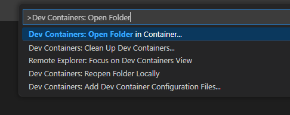
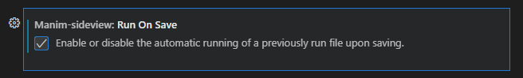

# Manim Workspace Template

For `manim` animators who doesn't want to install package managers and dependencies (e.g. LaTeX) in their local machine to have a working `manim` environment.

This workspace utilizes Dev Containers that handle `manim` installation, dependencies, and updates. The container uses `manim` [Docker image](https://hub.docker.com/r/manimcommunity/manim/tags).

This Dev Container also comes with LaTeX for rendering Math text and [Manim Sideview](https://github.com/Rickaym/manim-sideview) VS Code Extension. For details on using the extension, visit the extension [page](https://marketplace.visualstudio.com/items?itemName=Rickaym.manim-sideview).

You can also use this container to run manim on JupyterLab. For details, see [Using the Workspace - Jupyter Lab](#jupyter-lab)

## Setup
### GitHub Codespaces
Click the link below, create a `manim` [Scene](src/example_scene.py), and enjoy working on your environment.

### Dev Containers

> [!IMPORTANT]
> You must have [Docker](https://www.docker.com/get-started/) and [Visual Studio Code](https://code.visualstudio.com/download) with [Dev Containers](https://marketplace.visualstudio.com/items?itemName=ms-vscode-remote.remote-containers) extension installed

1. [Download](https://github.com/KaidenFrizu/manim-workspace/archive/refs/heads/main.zip) (or [Clone](https://code.visualstudio.com/docs/sourcecontrol/intro-to-git)) this repository.

   > [!NOTE]
   > If you've downloaded the repository, make sure to extract the contents in your `.zip` file

2. In VS Code, Open the Command Palette (`F1` / `Ctrl + Shift + P` / `Cmd + Shift + P`)

3. Search and select *"Dev Containers: Open Folder in Container"*

   

4. Select the folder that was downloaded/cloned to your computer.

5. Create a `manim` [Scene](src/example_scene.py) and enjoy working on your environment.

> [!TIP]
> To re-open the container when you launch VS Code again, follow steps 2-5

## Using the Container
You can use one (or both) of the methods to create and render animations in `manim`, depending on your preference.

### Manim Sideview

1. Open up a [Scene](src/example_scene.py) in your Dev Container Environment.
2. Open the Command Palette (`F1` / `Ctrl + Shift + P` / `Cmd + Shift + P`) and look for *"Manim: Render a New Scene"*
3. Select the scene from your current file that you wanted to render.
4. The output file would be autoplayed on the right side of your VS Code window.

   

> [!TIP]
> You can modify your settings in VS Code to automatically render the current scene on saving the `.py` file.
> 

> [!TIP]
> For more details on how to use Manim Sideview, visit:
> https://github.com/Rickaym/Manim-Sideview

### Jupyter Lab

1. In your Dev Container environment, open a terminal (`` Ctrl + ` ``).
2. Run the command `jupyter lab`.
3. Open one of the `http` URLs given in the terminal to your browser.
4. From the Jupyter environment, create a [notebook](src/example_notebook.ipynb) and enjoy creating animations from here.

> [!TIP]
> To shutdown your current Jupyter Lab server, press `Ctrl + C` on the same terminal, or go to `File -> Shut Down` in Jupyter Lab window.

> [!TIP]
> For more examples using `manim` on notebooks, visit:
> https://github.com/ManimCommunity/jupyter_examples

## I have a question using this container. Where do I ask?
You can ask through [Discussions](https://github.com/KaidenFrizu/manim-workspace/discussions). Be sure to search for existing questions or threads and ask from there. Otherwise, you can make a new one.

## I have an issue or a feature request for this template
You can post these in [Issues](https://github.com/KaidenFrizu/manim-workspace/issues). Make sure that the issue or a feature request that you want has no duplicates by searching first.
